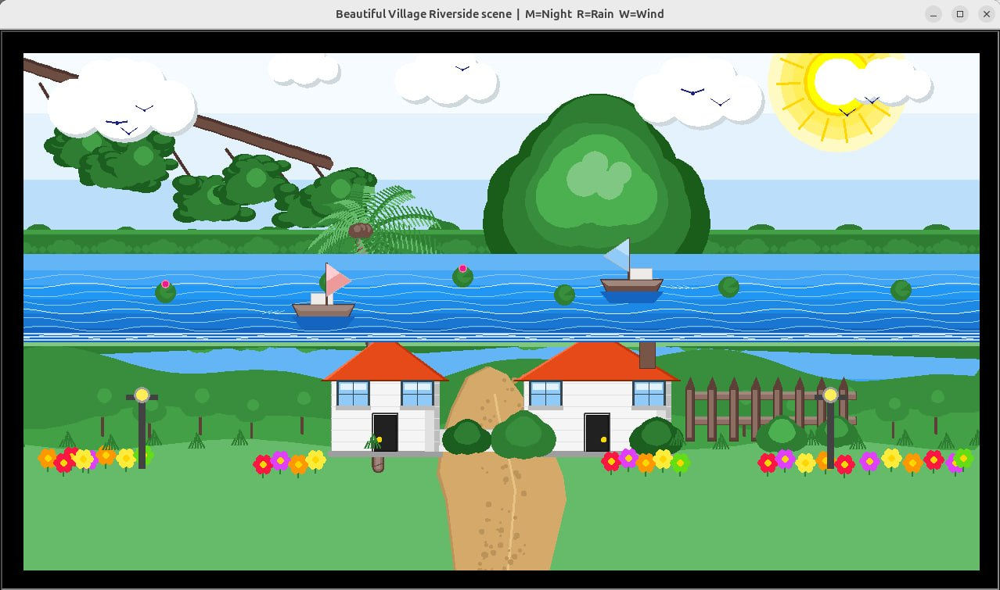
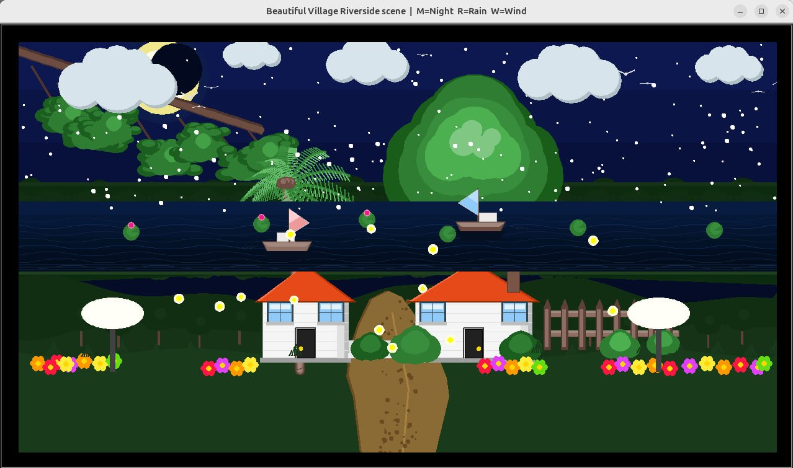

# 🏡 Beautiful Village Riverside Scene

> An animated, interactive village landscape built entirely with **Python Turtle Graphics** — featuring dynamic day/night cycles, weather effects, and lively animations.

---

## 🖼️ Screenshots

### ☀️ Day Mode


### 🌙 Night Mode


---

## ✨ Features

| Feature | Key | Description |
|--------|-----|-------------|
| 🌙 Night / ☀️ Day Toggle | `M` | Switches between full day and night palettes — sky, water, grass, trees, lamps all change colour |
| 🌧️ Rain | `R` | 130 animated raindrops fall at varying speeds and angles |
| 🍃 Wind | `W` | 40 leaves fly across the scene, each spinning with rotation matrix math |
| 🐦 Birds | auto | 8 birds fly left-to-right with realistic wing-flapping (sine wave) |
| 🌊 River | auto | Sinusoidal waves scroll continuously across the river |
| ☁️ Clouds | auto | 5 clouds drift at different speeds and sizes |
| ⛵ Boats | auto | 2 boats sail in opposite directions with flags and wake |
| 🌟 Stars | night | 180 randomly placed stars twinkle individually |
| 🌛 Moon | night | Crescent moon rendered using overlapping circles (Midpoint Circle trick) |
| 🌻 Fireflies | night | 28 fireflies blink and drift using sinusoidal brightness and Lissajous motion |
| 💡 Lamp Glow | night | Street lamps emit elliptical glow halos |

---

## 📁 Project Structure

```
village_scene/
├── config.py       — Colours, canvas size, mode flags (NIGHT/RAIN/WIND), static data
├── renderer.py     — Drawing primitives: rect, circle, polygon, ellipse, bezier
├── environment.py  — Sky, sun/moon, stars, clouds, river, boats, grass, forest, trees
├── scene.py        — Houses, fence, bushes, lamp posts, flowers, grass tufts
├── animation.py    — Birds, fireflies, rain drops, wind-blown leaves
└── main.py         — Screen setup, turtle layers, animation loop, keyboard input
```

---

## 🚀 How to Run

**Requirements:** Python 3.x (turtle is built-in — no pip install needed)

```bash
# Clone the repository
git clone https://github.com/abdeyrabby404/Computer-Graphics-project--beautiful-village
cd village-riverside-scene

# Run the project
python main.py
```

A 1280×720 window will open. Use the keys below to interact:

```
M  →  Toggle Night / Day mode
R  →  Toggle Rain on / off
W  →  Toggle Wind + Leaves on / off
```

---

## 🎨 Computer Graphics Algorithms Used

This project implements several classic CG algorithms from scratch:

| Algorithm | Where Used in Project |
|-----------|----------------------|
| **DDA Line Algorithm** | Rain drops, bird wings, fence, wall texture lines |
| **Bresenham's Line** | Horizontal wall stripes, fence rails, diagonal palm marks |
| **Midpoint Circle Algorithm** | Sun (6×), moon (crescent trick), clouds, flowers, bushes, fireflies |
| **Parametric Ellipse** | Tree leaves, lamp glow halos, sun ray positions |
| **Scan-Line Polygon Fill** | House roof/walls, grass layers, winding path, boat hull |
| **Cubic Bezier Curve** | Overhanging tree branch — `B(t)=(1-t)³P0+3(1-t)²tP1+3(1-t)t²P2+t³P3` |
| **Sinusoidal Wave** | River waves (phase-shifted), bird flap, firefly blink, grass edge |
| **2D Rotation Matrix** | Wind-blown spinning leaves |

---

## 🏗️ Architecture — Turtle Layering System

The scene uses **16 separate turtle objects** drawn in order (bottom → top):

```
border_t → sky_t → star_t → sun_t → cloud_t → water_t → boat_t
→ forest_t → far_t → grass_t → tree_t → house_t → detail_t
→ bird_t → fx_t → over_t
```

Each turtle is an independent layer. Clearing `fx_t` (rain, fireflies) never touches the sky or houses. The topmost `over_t` re-stamps the border every frame so animations never bleed outside the canvas.

---

## ⚙️ How the Modes Work

### Night Mode (`M`)
- `C.NIGHT` flag flips `True ↔ False`
- Every draw function reads this flag and selects the correct colour palette
- `draw_static()` is called to re-render the entire static scene in new colours
- Fireflies appear, stars twinkle, lamp glow activates, moon replaces sun

### Rain Mode (`R`)
- `C.RAINING` flag flips — no redraw needed
- `update_rain()` and `draw_rain()` both start with `if not C.RAINING: return`
- 130 drops reset to a random x at the top when they hit the bottom

### Wind Mode (`W`)
- `C.WINDY` flag flips
- 40 leaves use a **rotation matrix** to spin while drifting rightward
- Each leaf has an independent rotation speed (`rs`) and colour

---

## 📐 Technical Details

- **Canvas:** 1240×680 px scene inside a 1280×720 window
- **Frame rate:** ~50 FPS (20 ms timer via `screen.ontimer`)
- **Rendering:** `turtle.tracer(0,0)` + manual `turtle.update()` for flicker-free animation
- **Randomness:** All random data seeded (`random.seed(42/55/33/99)`) for reproducible scenes

---

## 📄 License

This project was created as a university Computer Graphics course assignment.  
Feel free to use for educational purposes.

---

<p align="center">Made with 🐢 Python Turtle Graphics</p>
